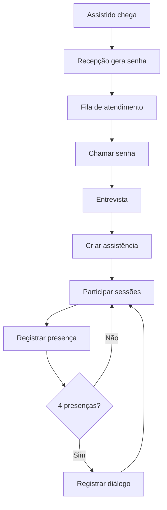
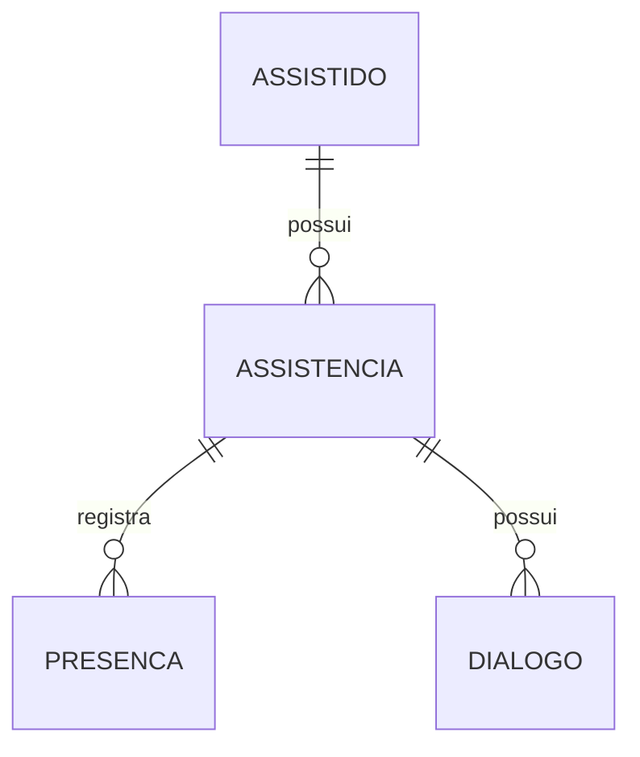
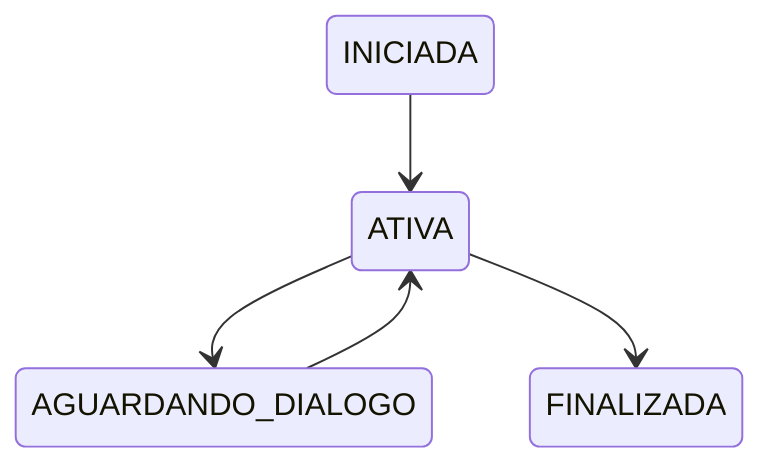

# Sistema de Controle de Presença - CEOV (FULL V2)

---

# 1. Visão Geral
Sistema para gestão de atendimento espiritual incluindo recepção, entrevistas, acompanhamento e controle de presença.

Objetivo principal: permitir operação rápida, simples e confiável em ambiente movimentado, com foco mobile/tablet-first.

---

# 2. Fluxo de Atendimento



---

# 3. Contextos de Domínio

## Recepção
- Geração de senha
- Controle de fila

## Atendimento Espiritual
- Entrevista
- Assistência
- Presença
- Diálogo

---

# 4. Linguagem Ubíqua

- Assistência: agregado principal
- Atendimento: participação completa
- Presença: registro de atendimento
- Entrevista: início da assistência
- Diálogo: acompanhamento

---

# 5. Modelo de Domínio

## Princípio Central
Assistência é o agregado raiz.



```json
{
  "id": "uuid",
  "status": "ATIVA"
}
```

---

# 6. Regras de Negócio

- presença apenas em ATIVA
- 4 presenças → AGUARDANDO_DIALOGO
- bloquear novas presenças
- diálogo libera ciclo

---

# 7. Máquina de Estados



---

# 8. Casos de Uso

## Chamar próxima senha

Fluxo:
1. GET /v1/senhas/aguardando
2. Selecionar
3. POST /v1/senhas/chamar

Regras:
- FIFO
- Apenas AGUARDANDO

UI:
```
CHAMAR SENHA

Nº | Tipo | Tempo | Status | Ação
--------------------------------
101 | Normal | 5m | AGUARDANDO | [Chamar]
102 | Pref | 2m | AGUARDANDO | [Chamar]

Selecionada: 101

[ CHAMAR SENHA ]
```

---

## Registrar presença

Fluxo:
1. GET /assistidos
2. POST /presencas

Regras:
- status ATIVA

UI:
```
REGISTRO PRESENÇA
Buscar
Lista
Selecionar
[ Registrar ]
```

---

## Registrar diálogo

Fluxo:
1. POST /dialogos

Regras:
- estado AGUARDANDO_DIALOGO

UI:
```
REGISTRAR DIÁLOGO

Assistido
Status
Observações
[ Registrar ]
```

---

# 9. APIs

/v1/senhas
/v1/presencas
/v1/dialogos

---

# 10. Arquitetura

- Angular
- Quarkus
- MongoDB
- Keycloak

---

# 11. Final

Spec completa pronta para IA
