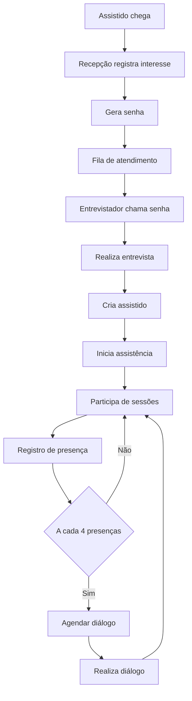
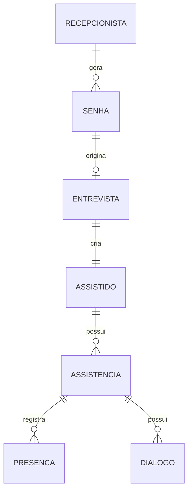
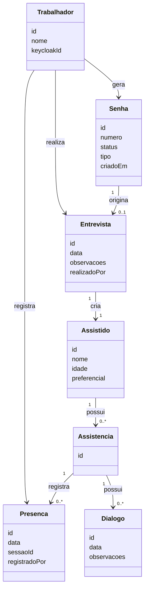

# Sistema de Controle de Presença - CEOV

## 1. Visão Geral
Sistema para gestão de atendimento espiritual incluindo recepção, entrevistas, acompanhamento e presença.

## 2. Fluxo de Atendimento


## 3. Contextos de Domínio

### Recepção
- Geração de senha
- Controle de fila

### Atendimento Espiritual
- Entrevista
- Assistido
- Presenças
- Diálogos

## 4. Modelo de Dados (Visão ER)


## 5. Estrutura das Entidades (Classe)


## 6. APIs

### Recepção
- POST /senhas
- GET /senhas/aguardando
- POST /senhas/chamar

### Entrevista
- POST /entrevistas

### Presença
- POST /presencas

## 7. Arquitetura
- Backend: Quarkus
- Frontend: Angular + PrimeNG
- Banco: MongoDB
- Auth: Keycloak

## 8. Segurança
- Autenticação via Keycloak (OIDC)
- RBAC via roles no Keycloak
- Backend valida JWT

## 9. Observabilidade
- Logs estruturados
- OpenTelemetry
- Prometheus + Grafana

## 10. Diferenciais
- Fila digital
- QR Code para presença
- Métricas de atendimento

## 11. Roadmap Produto

### MVP
- Cadastro
- Fila
- Presença

### Evolução
- Relatórios
- Notificações
- Multi-tenant

## 12. Comercialização
- SaaS multi-tenant
- Plano gratuito limitado
- Plano pago por instituição

## 13. Casos de Uso Detalhados (Base para Evolução)

---

## 1. Cadastro no Sistema

### Objetivo
Permitir que um trabalhador crie sua conta de acesso ao sistema.

### Ator
- Trabalhador

### Pré-condições
- Nenhuma (acesso inicial)

### Fluxo principal
1. Trabalhador acessa tela de cadastro
2. Informa dados necessários
3. Sistema cria usuário no Keycloak
4. Sistema confirma cadastro

### Tela: Cadastro

#### Contexto
- Baixa frequência
- Usuário comum

#### Prioridade
- simplicidade > velocidade

#### Layout
- formulário central
- botão de ação ao final

#### Componentes
- input nome
- input email
- input senha
- botão cadastrar

#### Ações
- preencher formulário
- submeter cadastro

#### Regras
- validação de campos obrigatórios

#### Estilo
- simples

#### Wireframe
```text
------------------------------------
       CADASTRO DE USUÁRIO
------------------------------------

Nome:
[.................................]

Email:
[.................................]

Senha:
[.................................]

------------------------------------
[        Cadastrar        ]
------------------------------------

Já possui conta? [Login]
```

---

## 2. Login

### Objetivo
Autenticar trabalhador no sistema

### Ator
- Trabalhador

### Fluxo principal
1. Trabalhador acessa sistema
2. Sistema redireciona para Keycloak
3. Trabalhador autentica
4. Retorna autenticado

### Tela: Login

#### Contexto
- executado frequentemente

#### Prioridade
- confiabilidade

#### Layout
- externo (Keycloak)

#### Observações
- gerenciado pelo Keycloak

#### Wireframe
```text
------------------------------------
            LOGIN
------------------------------------

Email:
[.................................]

Senha:
[.................................]

------------------------------------
[          Entrar        ]
------------------------------------

[ Esqueci minha senha ]
```

---

## 3. Atribuição de Roles

### Objetivo
Permitir gerenciar permissões

### Ator
- Admin

### Tela

#### Layout
- lista de usuários
- seleção de roles

#### Componentes
- tabela usuários
- seletor de roles

#### Regras
- apenas admin pode acessar

#### Wireframe
```text
------------------------------------
        GERENCIAR USUÁRIOS
------------------------------------

Buscar:
[.................................]

------------------------------------
Usuários:

- João Silva         [Editar]
- Maria Souza        [Editar]

------------------------------------

Selecionado: João Silva

Roles:
[ ] trabalhador
[ ] admin

------------------------------------
[      Salvar Alterações      ]
------------------------------------
```

---

## 4. Emissão de Senha

### Objetivo
Gerar senha de atendimento

### Ator
- Trabalhador

### Tela

#### Contexto
- ambiente movimentado

#### Prioridade
- velocidade

#### Layout
- botão principal em destaque

#### Componentes
- botão gerar senha
- lista de senhas

#### Regras
- trabalhador autenticado

#### Wireframe
```text
------------------------------------
         EMISSÃO DE SENHA
------------------------------------

------------------------------------
[      GERAR NOVA SENHA      ]
------------------------------------

Últimas senhas geradas:

- 101
- 102
- 103

------------------------------------
```

---

## 5. Entrevista e Criação da Assistência

### Objetivo
Registrar entrevista inicial e iniciar assistência

### Ator
- Trabalhador

### Tela

#### Layout
- formulário

#### Componentes
- dados assistido
- observações

#### Regras
- associar trabalhador

#### Wireframe
```text
------------------------------------
            ENTREVISTA
------------------------------------

Nome:
[.................................]

Idade:
[.....]

Preferencial:
[ ] SIM

------------------------------------

Observações:
[..................................]
[..................................]

------------------------------------
[   Finalizar Entrevista   ]
------------------------------------
```

---

## 6. Registro de Presença

### Objetivo
Registrar presença rapidamente

### Ator
- Trabalhador

### Pré-condições
- trabalhador autenticado

### Fluxo principal
1. Buscar assistido
2. Selecionar assistido
3. Registrar presença

### Tela: Registro de Presença

#### Contexto
- ambiente movimentado
- uso frequente

#### Prioridade
- velocidade de uso > estética

#### Layout
- topo: busca
- meio: lista
- rodapé: ação

#### Componentes
- input busca
- lista resultados
- botão registrar

#### Ações
- buscar
- selecionar
- registrar

#### Regras
- não registrar sem seleção
- associar trabalhador

#### Estilo
- simples

#### Wireframe
```text
------------------------------------
     REGISTRO DE PRESENÇA
------------------------------------

Buscar assistido:
[ Nome ou nº cartão............... ]

------------------------------------

Resultados:

- João Silva (Cartão 1234)   [Selecionar]
- Maria Souza (Cartão 4567)  [Selecionar]

------------------------------------

Selecionado:
João Silva (Cartão 1234)

------------------------------------
[     Registrar Presença     ]
------------------------------------
```

---

## 7. Recuperação de Senha

### Objetivo
Permitir que o trabalhador recupere acesso ao sistema em caso de esquecimento de senha.

### Ator
- Trabalhador

### Pré-condições
- Trabalhador já possui conta cadastrada

### Fluxo principal
1. Trabalhador acessa opção "Esqueci minha senha"
2. Sistema redireciona para fluxo de recuperação no Keycloak
3. Trabalhador informa e-mail ou usuário
4. Keycloak envia instruções (ex: e-mail)
5. Trabalhador define nova senha
6. Trabalhador consegue autenticar novamente

### Tela: Recuperação de Senha

#### Contexto
- uso eventual
- fora do fluxo operacional

#### Prioridade
- simplicidade > tudo

#### Layout
- tela simples com campo único e ação principal

#### Componentes
- input (e-mail ou usuário)
- botão "Recuperar senha"
- link "Voltar para login"

#### Ações
- preencher e confirmar
- seguir instruções externas

#### Regras
- não expor se usuário existe ou não
- fluxo delegado ao Keycloak

#### Estilo
- simples

---

## Observação
Todos os casos são base inicial e devem ser refinados posteriormente.

### 14. Wireframes (Visão Textual)
#### Registro de Presença
```text
------------------------------------
     REGISTRO DE PRESENÇA
------------------------------------

Buscar assistido:
[ Nome ou nº cartão............... ]

------------------------------------

Resultados:

- João Silva (Cartão 1234)   [Selecionar]
- Maria Souza (Cartão 4567)  [Selecionar]

------------------------------------

Selecionado:
João Silva (Cartão 1234)

------------------------------------
[     Registrar Presença     ]
------------------------------------
```

#### Recuperação de Senha
```text
------------------------------------
      RECUPERAR SENHA
------------------------------------

Informe seu e-mail:

[.................................]

------------------------------------
[     Recuperar senha      ]
------------------------------------

[ Voltar para login ]
```


### 15. Diretrizes de UX (Mobile/Tablets First)
(Conforme definido anteriormente)

---

### 16. Definição Detalhada de APIs

#### Convenção
- Base: /v1
- JSON como formato padrão
- Autenticação via JWT (Keycloak)

---

### Senhas (Tela: Emissão de Senha)

#### POST /v1/senhas
Cria uma nova senha de atendimento

Request:
{}

Response:
{
  "id": "uuid",
  "numero": 101,
  "status": "AGUARDANDO"
}

HTTP:
- 201 Created

Erros:
- 401 Unauthorized

Regras:
- somente trabalhador autenticado pode gerar
- número da senha é incremental

---

#### PATCH /v1/senhas/{id}/chamada
Marca senha como chamada

Response:
{
  "status": "EM_ATENDIMENTO"
}

HTTP:
- 200 OK
- 404 Not Found

---

### Assistidos (Tela: Registro de Presença)

#### GET /v1/assistidos?busca=
Busca assistidos para operação rápida

Response:
[
  {
    "id": "uuid",
    "nome": "João",
    "cartao": "1234"
  }
]

HTTP:
- 200 OK

Regras:
- retorno leve (otimizado para tablet)

---

#### POST /v1/assistidos
Cria assistido

Request:
{
  "nome": "João",
  "idade": 35,
  "preferencial": false
}

Response:
{
  "id": "uuid"
}

HTTP:
- 201 Created

---

### Entrevistas (Tela: Entrevista e Criação da Assistência)

#### POST /v1/entrevistas
Cria entrevista e assistência vinculada

Request:
{
  "assistido": {
    "nome": "João",
    "idade": 35
  },
  "observacoes": "..."
}

Response:
{
  "assistidoId": "uuid",
  "assistenciaId": "uuid"
}

HTTP:
- 201 Created

Erros:
- 400 dados inválidos

Regras:
- cria assistido se não existir
- cria assistência automaticamente
- associa trabalhador autenticado

---

### Presenças (Tela: Registro de Presença)

#### POST /v1/presencas
Registra presença

Request:
{
  "assistidoId": "uuid"
}

Response:
{
  "id": "uuid",
  "data": "YYYY-MM-DD"
}

HTTP:
- 201 Created

Erros:
- 404 assistido não encontrado
- 409 assistência não encontrada

Regras:
- identifica trabalhador via JWT
- vincula à assistência ativa
- registra data atual

---

### Diálogos (Tela futura)

#### POST /v1/dialogos

Request:
{
  "assistenciaId": "uuid",
  "observacoes": "..."
}

Response:
{
  "id": "uuid"
}

HTTP:
- 201 Created

---

### Trabalhador (Contexto geral)

#### GET /v1/trabalhadores/me

Response:
{
  "id": "uuid",
  "nome": "Nome"
}

HTTP:
- 200 OK

Regras:
- derivado do token JWT


---

## 17. Ubiquitous Language Atualizado

### Conceitos refinados
- Atendimento = participação completa (Palestra + Passe)
- Presença representa exatamente um atendimento
- Cartão físico = Assistência (mesmo conceito no sistema)

---

## 18. Modelo Final de Assistência (IA-Ready)

```json
{
  "id": "uuid",
  "numeroCartao": 4293,
  "tipo": "A1",
  "status": "ATIVA",
  "assistido": {
    "nome": "Joao",
    "idade": 21
  },
  "entrevista": {
    "data": "2026-06-01",
    "realizadoPor": "keycloak-sub"
  },
  "presencas": [
    {
      "data": "2026-06-02",
      "registradoPor": "keycloak-sub"
    }
  ],
  "dialogos": [
    {
      "id": "uuid",
      "data": "2026-06-10",
      "realizadoPor": "keycloak-sub"
    }
  ]
}
```

---

## 19. Máquina de Estado Consolidada

Estados:
- INICIADA
- ATIVA
- AGUARDANDO_DIALOGO
- FINALIZADA

Transições:
- INICIADA → ATIVA
- ATIVA → AGUARDANDO_DIALOGO (a cada 4 presenças)
- AGUARDANDO_DIALOGO → ATIVA (após diálogo)
- ATIVA → FINALIZADA

Regras:
- Não permitir presença fora de estado ATIVA

---

## 20. Observabilidade para IA (Spec Driven)

Este documento agora atende requisitos para geração automática:

- Domínio explícito
- Estados definidos
- Fluxos previsíveis
- APIs descritas
- Wireframes presentes

Permite:
- geração automática de backend
- geração de testes
- validação de regras
- documentação viva

