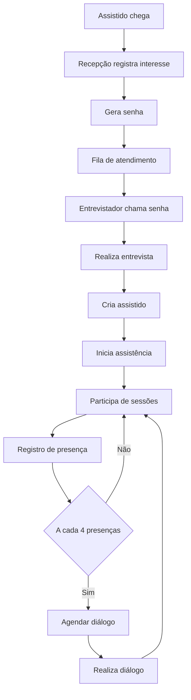
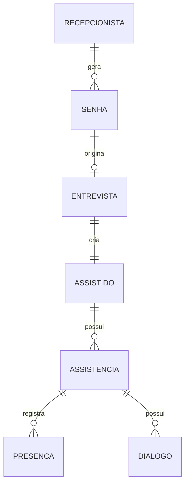

# Sistema de Controle de Presença - CEOV

## 1. Visão Geral
Sistema para gestão de atendimento espiritual incluindo recepção, entrevistas, acompanhamento e presença.

---

## 2. Fluxo de Atendimento

---

## 3. Contextos de Domínio

### Recepção
- Geração de senha
- Controle de fila

### Atendimento Espiritual
- Entrevista
- Assistido
- Presenças
- Diálogos

---

## 4. Modelo de Dados

---

## 5. Estrutura das Entidades

### Senha
- id
- numero
- status
- tipo
- criadoEm

### Assistido
- id
- nome
- idade
- preferencial

### Entrevista
- id
- data
- observações

### Presença
- id
- data
- sessaoId

### Diálogo
- id
- data
- observações

---

## 6. APIs

### Recepção
- POST /senhas
- GET /senhas/aguardando
- POST /senhas/{id}/chamar

### Entrevista
- POST /entrevistas

### Presença
- POST /presencas

---

## 7. Arquitetura

- Backend: Quarkus
- Frontend: Angular + PrimeNG
- Banco: MongoDB
- Auth: Keycloak

---

## 8. Segurança

- RBAC (Admin, Recepção, Trabalhador)
- SSO com Keycloak

---

## 9. Observabilidade

- Logs estruturados
- OpenTelemetry
- Prometheus + Grafana

---

## 10. Diferenciais

- Fila digital
- QR Code para presença
- Métricas de atendimento

---

## 11. Roadmap Produto

### MVP
- Cadastro
- Fila
- Presença

### Evolução
- Relatórios
- Notificações
- Multi-tenant

---

## 12. Comercialização

- SaaS multi-tenant
- Plano gratuito limitado
- Plano pago por instituição
