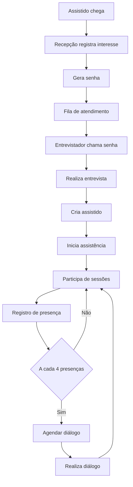
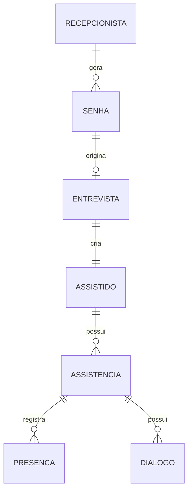
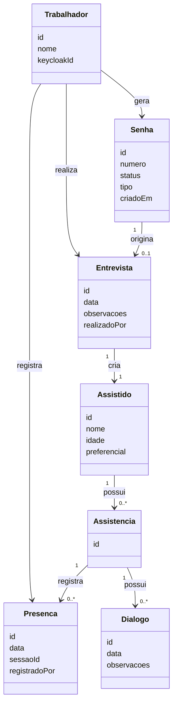

# Sistema de Controle de Presença - CEOV

## 1. Visão Geral
Sistema para gestão de atendimento espiritual incluindo recepção, entrevistas, acompanhamento e presença.

## 2. Fluxo de Atendimento

## 3. Contextos de Domínio

### Recepção
- Geração de senha
- Controle de fila

### Atendimento Espiritual
- Entrevista
- Assistido
- Presenças
- Diálogos

## 4. Modelo de Dados (Visão ER)

## 5. Estrutura das Entidades (Classe)

## 6. APIs

### Recepção
- POST /senhas
- GET /senhas/aguardando
- POST /senhas/chamar

### Entrevista
- POST /entrevistas

### Presença
- POST /presencas

## 7. Arquitetura
- Backend: Quarkus
- Frontend: Angular + PrimeNG
- Banco: MongoDB
- Auth: Keycloak

## 8. Segurança
- Autenticação via Keycloak (OIDC)
- RBAC via roles no Keycloak
- Backend valida JWT

## 9. Observabilidade
- Logs estruturados
- OpenTelemetry
- Prometheus + Grafana

## 10. Diferenciais
- Fila digital
- QR Code para presença
- Métricas de atendimento

## 11. Roadmap Produto

### MVP
- Cadastro
- Fila
- Presença

### Evolução
- Relatórios
- Notificações
- Multi-tenant

## 12. Comercialização
- SaaS multi-tenant
- Plano gratuito limitado
- Plano pago por instituição

## 13. Casos de Uso (a detalhar)
- Cadastro no sistema  
  - Trabalhador realiza cadastro criando credenciais de acesso  

- Login  
  - Trabalhador autentica antes de utilizar o sistema  

- Atribuição / atualização de roles  
  - Trabalhador com role admin gerencia permissões  

- Emissão de senha  
  - Trabalhador autenticado gera senha de atendimento  

- Entrevista e criação da assistência  
  - Trabalhador realiza entrevista e cria assistência  

- Registro de presença  
  - Trabalhador registra presença do assistido  
