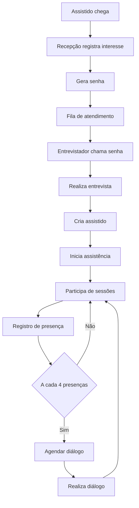
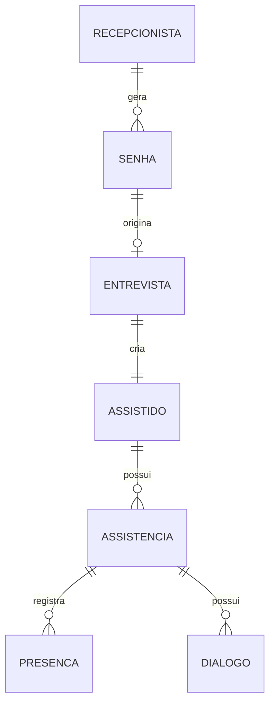
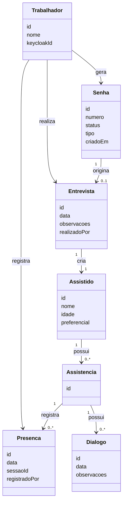

# Sistema de Controle de Presença - CEOV

## 1. Visão Geral
Sistema para gestão de atendimento espiritual incluindo recepção, entrevistas, acompanhamento e presença.

## 2. Fluxo de Atendimento


## 3. Contextos de Domínio

### Recepção
- Geração de senha
- Controle de fila

### Atendimento Espiritual
- Entrevista
- Assistido
- Presenças
- Diálogos

## 4. Modelo de Dados (Visão ER)


## 5. Estrutura das Entidades (Classe)


## 6. APIs

### Recepção
- POST /senhas
  - descrição: gera uma senha na base de dados.

- GET /senhas?status=aguardando
  - descrição: listagem de todas as senhas aguardando atendimento.

- GET /senhas/chamar
  - descrição: chama a proxima senha a ser atendida na entrevista.

### Entrevista
- POST /entrevistas
  - descrição: cria na base de dados um documento que agregara todo o processo de assistencia espiritual. Representa um cartao preenchido pelo entrevistador e entregue ao assistido para que o controle de presença seja efetuado.

### Presença
- PATCH /presencas
  - descrição: registra a presença que é representada pela atualizaçao do documento inicialmente gerado no POST /entrevistas.

## 7. Arquitetura
- Backend: Quarkus
- Frontend: Angular + PrimeNG
- Banco: MongoDB
- Auth: Keycloak

## 8. Segurança
- Autenticação via Keycloak (OIDC)
- RBAC via roles no Keycloak
- Backend valida JWT

## 9. Observabilidade
- Logs estruturados
- OpenTelemetry
- Prometheus + Grafana

### Evolução
- Relatórios
- Notificações
- Multi-tenant

## 13. Casos de Uso Detalhados (Base para Evolução)

---

## 1. Cadastro no Sistema

### Objetivo
Permitir que um trabalhador crie sua conta de acesso ao sistema.

### Ator
- Trabalhador

### Pré-condições
- Nenhuma (acesso inicial)

### Fluxo principal
1. Trabalhador acessa tela de cadastro
2. Informa dados necessários
3. Sistema cria usuário no Keycloak
4. Sistema confirma cadastro

### Tela: Cadastro

#### Contexto
- Baixa frequência
- Usuário comum

#### Prioridade
- simplicidade > velocidade

#### Layout
- formulário central
- botão de ação ao final

#### Componentes
- input nome
- input email
- input senha
- botão cadastrar

#### Ações
- preencher formulário
- submeter cadastro

#### Regras
- validação de campos obrigatórios

#### Estilo
- simples

---

## 2. Recuperação de Senha

### Objetivo
Permitir que o trabalhador recupere acesso ao sistema em caso de esquecimento de senha.

### Ator
- Trabalhador

### Pré-condições
- Trabalhador já possui conta cadastrada

### Fluxo principal
1. Trabalhador acessa opção "Esqueci minha senha"
2. Sistema redireciona para fluxo de recuperação no Keycloak
3. Trabalhador informa e-mail ou usuário
4. Keycloak envia instruções (ex: e-mail)
5. Trabalhador define nova senha
6. Trabalhador consegue autenticar novamente

### Tela: Recuperação de Senha

#### Contexto
- uso eventual
- fora do fluxo operacional

#### Prioridade
- simplicidade > tudo

#### Layout
- tela simples com campo único e ação principal

#### Componentes
- input (e-mail ou usuário)
- botão "Recuperar senha"
- link "Voltar para login"

#### Ações
- preencher e confirmar
- seguir instruções externas

#### Regras
- não expor se usuário existe ou não
- fluxo delegado ao Keycloak

#### Estilo
- simples

---

## 3. Login

### Objetivo
Autenticar trabalhador no sistema

### Ator
- Trabalhador

### Fluxo principal
1. Trabalhador acessa sistema
2. Sistema redireciona para Keycloak
3. Trabalhador autentica
4. Retorna autenticado

### Tela: Login

#### Contexto
- executado frequentemente

#### Prioridade
- confiabilidade

#### Layout
- externo (Keycloak)

#### Observações
- gerenciado pelo Keycloak

---

## 4. Atribuição de Roles

### Objetivo
Permitir gerenciar permissões

### Ator
- Admin

### Tela

#### Layout
- lista de usuários
- seleção de roles

#### Componentes
- tabela usuários
- seletor de roles

#### Regras
- apenas admin pode acessar

---

## 5. Emissão de Senha

### Objetivo
Gerar senha de atendimento

### Ator
- Trabalhador (recepção)

### Tela

#### Contexto
- ambiente movimentado

#### Prioridade
- velocidade

#### Layout
- botão principal em destaque

#### Componentes
- botão gerar senha
- lista de senhas

#### Regras
- trabalhador autenticado

#### Endpoint
- POST /senhas

---

## 6. Chamar proxima senha

### Objetivo
Chamar a próxima pessoa a ser entrevistada

### Ator
- Trabalhador (Entrevistador)

### Pré-condições
- Trabalhador autenticado
- Existirem senhas com status aguardando

### Fluxo principal
- Trabalhador acessa tela de chamada
- Sistema exibe próxima senha disponível
- Trabalhador confirma chamada
- Sistema atualiza status da senha para em atendimento
- Sistema exibe senha chamada em destaque

### Tela

#### Contexto
- ambiente movimentado
- uso contínuo durante atendimento

#### Prioridade
- velocidade de uso > tudo

#### Layout
- topo: indicação da próxima senha
- centro: número em destaque (grande)
- rodapé: ação principal

#### Componentes
- label "Próxima senha"
- display grande do número da senha
- botão "Chamar senha"
- botão secundário opcional "Repetir chamada"

#### Ações
- chamar próxima senha
- repetir chamada (opcional, sem avançar fila)

#### Regras
- não permitir chamada se não houver senha
- ao chamar, remover da fila de aguardando
- garantir ordem FIFO (ou regra definida pelo backend)
- associar chamada ao trabalhador
- fornecer feedback imediato (visual e opcional sonoro)

#### Estilo
- número em destaque (muito grande)
- botão principal grande e central
- mínimo de informação na tela

#### Endpoint
- GET /senhas/chamar


#### Componentes

#### Regras

#### Endpoint

## 7. Entrevista e Criação da Assistência

### Objetivo
Registrar entrevista inicial e iniciar assistência

### Ator
- Trabalhador (Entrevistador)

### Tela

#### Layout
- formulário

#### Componentes
- dados assistido
- observações

#### Regras
- associar trabalhador

#### Endpoint
- POST /entrevistas

---

## 8. Registro de Presença

### Objetivo
Registrar presença rapidamente

### Ator
- Trabalhador

### Pré-condições
- trabalhador autenticado

### Fluxo principal
1. Buscar assistido
2. Selecionar assistido
3. Registrar presença

### Tela: Registro de Presença

#### Contexto
- ambiente movimentado
- uso frequente

#### Prioridade
- velocidade de uso > estética

#### Layout
- topo: busca
- meio: lista
- rodapé: ação

#### Componentes
- input busca
- lista resultados
- botão registrar

#### Ações
- buscar
- selecionar
- registrar

#### Regras
- não registrar sem seleção
- associar trabalhador

#### Estilo
- simples

#### Endpoint
- PATCH /presencas

---

## Observação
Todos os casos são base inicial e devem ser refinados posteriormente.

### 14. Wireframes (Visão Textual)

#### Cadastro
```text
------------------------------------
       CADASTRO DE USUÁRIO
------------------------------------

Nome:
[.................................]

Email:
[.................................]

Senha:
[.................................]

------------------------------------
[        Cadastrar        ]
------------------------------------

Já possui conta? [Login]
```

#### Login
```text
------------------------------------
            LOGIN
------------------------------------

Email:
[.................................]

Senha:
[.................................]

------------------------------------
[          Entrar        ]
------------------------------------

[ Esqueci minha senha ]
```

#### Atribuição de Roles
```text
------------------------------------
        GERENCIAR USUÁRIOS
------------------------------------

Buscar:
[.................................]

------------------------------------
Usuários:

- João Silva         [Editar]
- Maria Souza        [Editar]

------------------------------------

Selecionado: João Silva

Roles:
[ ] trabalhador
[ ] admin

------------------------------------
[      Salvar Alterações      ]
------------------------------------
```

#### Emissão de Senha
```text
------------------------------------
         EMISSÃO DE SENHA
------------------------------------

------------------------------------
[      GERAR NOVA SENHA      ]
------------------------------------

Últimas senhas geradas:

- 101
- 102
- 103

------------------------------------
```

#### Entrevista
```text
------------------------------------
            ENTREVISTA
------------------------------------

Nome:
[.................................]

Idade:
[.....]

Preferencial:
[ ] SIM

------------------------------------

Observações:
[..................................]
[..................................]

------------------------------------
[   Finalizar Entrevista   ]
------------------------------------
```

#### Registro de Presença
```text
------------------------------------
     REGISTRO DE PRESENÇA
------------------------------------

Buscar assistido:
[ Nome ou nº cartão............... ]

------------------------------------

Resultados:

- João Silva (Cartão 1234)   [Selecionar]
- Maria Souza (Cartão 4567)  [Selecionar]

------------------------------------

Selecionado:
João Silva (Cartão 1234)

------------------------------------
[     Registrar Presença     ]
------------------------------------
```

#### Recuperação de Senha
```text
------------------------------------
      RECUPERAR SENHA
------------------------------------

Informe seu e-mail:

[.................................]

------------------------------------
[     Recuperar senha      ]
------------------------------------

[ Voltar para login ]
```


### 15. Diretrizes de UX (Mobile/Tablets First)

#### Princípios
- Mobile-first: todas as telas devem ser pensadas primeiro para telas pequenas e touch
- Tablet como dispositivo principal de uso
- Desktop como secundário

#### Diretrizes de Interface
- Botões grandes (mínimo ~44px de altura)
- Espaçamento adequado para toque
- Uma ação principal por tela
- Reduzir elementos visuais desnecessários

#### Diretrizes de Uso
- Fluxos rápidos e lineares
- Minimizar cliques/toques
- Feedback imediato após ações

#### Prioridades de UX
- Velocidade de uso > estética
- Clareza > quantidade de informação
- Redução de erro operacional

#### Considerações Técnicas
- Aplicação deve ser responsiva
- Preparar para PWA (uso em tablets)
- Possível evolução para leitura de QR code


> Observação: Todos os wireframes foram pensados com foco mobile/tablet (elementos grandes, fluxo vertical e toque).
